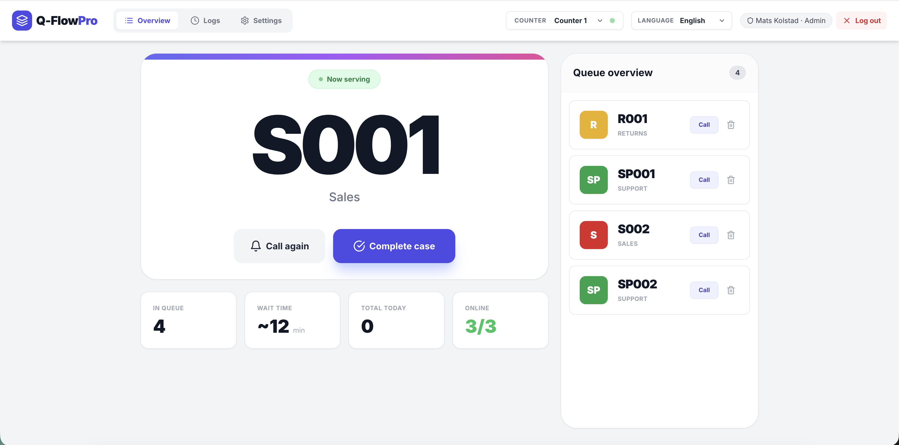
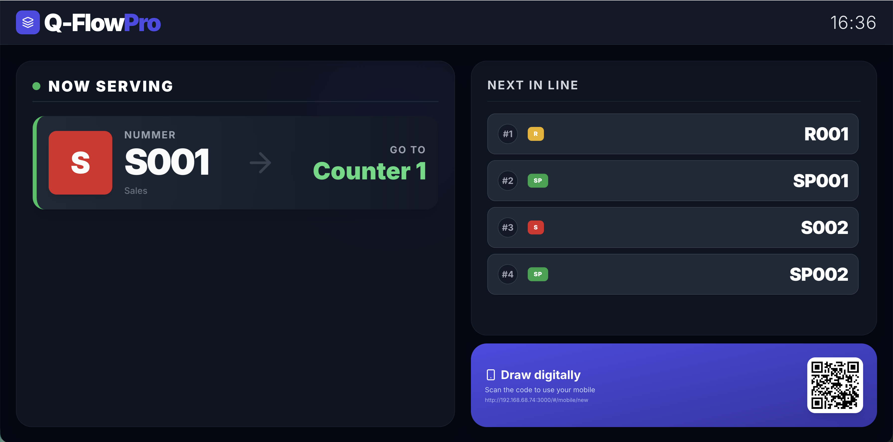
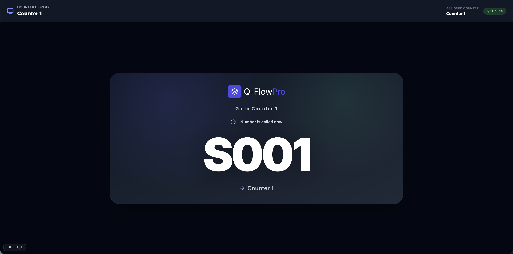
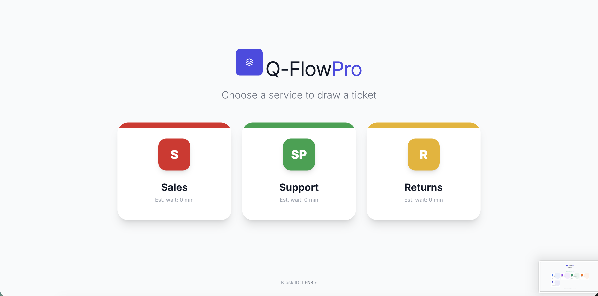
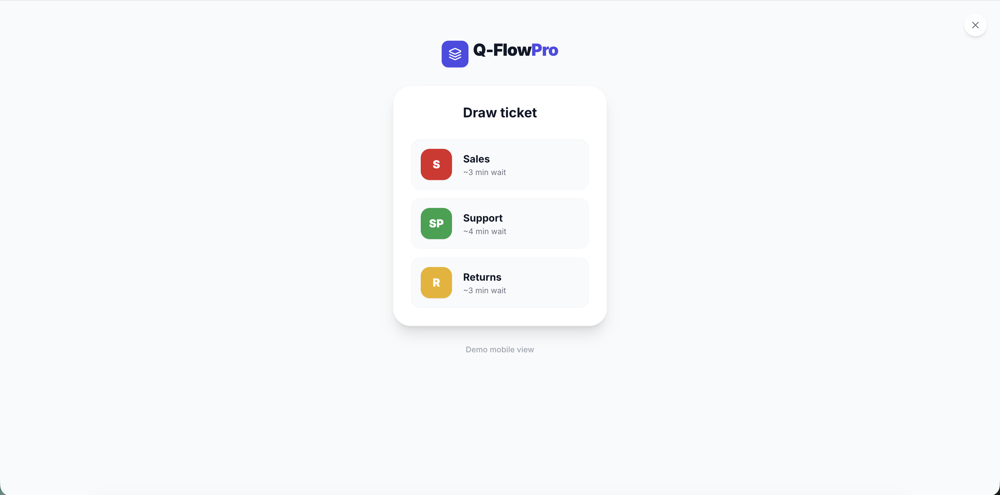

<div align="center">
  <h1>Q-Flow Pro</h1>
  <p>Queue and counter management with real-time updates, public displays, kiosk, counter screens, and admin panel.</p>
</div>

## ⚠️ Important Disclaimer

**This application is entirely developed using Artificial Intelligence (AI).**

The owner of this software makes **NO WARRANTIES** and assumes **NO LIABILITY** for:
- ❌ Software defects, bugs, or errors
- ❌ Security vulnerabilities or breaches  
- ❌ Data loss, corruption, or integrity issues
- ❌ Compliance with laws, regulations, or standards
- ❌ Fitness for any particular purpose

**BY USING THIS SOFTWARE, YOU ACCEPT FULL RESPONSIBILITY FOR:**
- ✅ Testing and validating the software for your use case
- ✅ Implementing appropriate security measures
- ✅ Conducting security audits and vulnerability assessments
- ✅ Ensuring compliance with applicable requirements
- ✅ Any consequences resulting from use of this software

**USE AT YOUR OWN RISK.** See [LICENSE](LICENSE) for complete terms.

---

## Documentation
- **[Installation Guide](INSTALLATION.md)** - Complete setup instructions and testing guide
- **[OAuth/OIDC Authentication](docs/oauth-oidc-auth.md)** - Configure Google Workspace and OIDC authentication
- **[Review Summary](REVIEW_SUMMARY.md)** - Comprehensive review results ([Norwegian version](GJENNOMGANG.md))
- **[Security Audit](SECURITY_AUDIT.md)** - Known vulnerabilities and security considerations
- **[CLI Documentation](docs/cli.en.md)** - Command-line user management ([Norwegian version](docs/cli.md))
- **[systemd Setup](docs/systemd.en.md)** - Linux service configuration ([Norwegian version](docs/systemd.md))

## Table of Contents
- [Features](#features)
- [Architecture](#architecture)
- [Screenshots](#screenshots)
- [Requirements](#requirements)
- [Quick Start (local)](#quick-start-local)
- [Environment Variables](#environment-variables)
- [Production Build](#production-build)
- [Run as systemd Service](#run-as-systemd-service)
- [Docker / Compose](#docker--compose)
- [Testing](#testing)
- [Admin Capabilities](#admin-capabilities)
- [Branding](#branding)
- [Data & Persistence](#data--persistence)
- [Operational Tips](#operational-tips)
- [User Management (GUI & CLI)](#user-management-gui--cli)
- [Using the System (flow)](#using-the-system-flow)

## Features
- Pull tickets from kiosk, mobile client, or operator.
- Real-time updates via Socket.IO (queue state, calls, messages).
- Public display (“now serving”) and counter display for targeted calls.
- Admin panel for services, counters, users, printers, announcements, sound, and closing.
- Security: session TTL, password policy, helmet headers, sanitized settings, optional CSP.
- SQLite persistence with backups, log rotation, and `/health` endpoint.

## Architecture
- Frontend: React + Vite (TypeScript). Built assets served from `dist` by the Node server.
- Backend: Node.js + Express + Socket.IO. Persistence: SQLite (`data/qflow.db`).
- Server owns state/logging; clients receive `init-state` + `state-update` events.

## Screenshots
- Admin dashboard: 
- Public display: 
- Counter display: 
- Kiosk: 
- Mobile client: 

## Requirements
- Node.js 18+ (LTS recommended)
- npm (bundled with Node)
- SQLite (embedded, no extra install)
- For server deploy: systemd (optional) and open port 3000 (default)

## Quick Start (local)
```sh
npm install
cp .env.example .env   # adjust if needed
npm run dev             # Vite dev on 5173, API proxied to 3000
```
- Frontend dev: http://localhost:5173
- Backend: http://localhost:3000
- **Default users on first run** (`db.json` defaults): admin/admin, operator/operator
- ⚠️ **SECURITY**: Default users are automatically flagged to change password on first login. You will be prompted to set a secure password immediately after logging in for the first time.

## Environment Variables
See [.env.example](.env.example). Key settings:
- `HOST` / `PORT`: binding (default 0.0.0.0:3000)
- `ALLOWED_ORIGINS`: comma-separated origins for CORS/WebSocket (add your domain for prod)
- `API_KEYS`: comma-separated API keys for additional endpoint protection (optional but recommended)
- `ALLOWED_API_IPS`: comma-separated IP addresses or CIDR blocks allowed to access API (optional)
- `ENABLE_CSP`: set `1` when frontend is CSP-clean
- `SESSION_TTL_HOURS`: session lifetime
- `LOG_RETENTION_DAYS`, `BACKUP_RETENTION_DAYS`: rotation periods

## Production Build
```sh
npm install
npm run build    # tsc + Vite build → dist/
npm start        # node server.js (serves dist/ and API)
```
Health: `GET /health`.

## Run as systemd Service
1) Copy unit: `sudo cp systemd/qflow.service /etc/systemd/system/qflow.service`
2) Environment: `/etc/qflow/qflow.env` (see .env.example) with permissions 640, owner `qflow`
3) User/ownership: `sudo useradd --system --home /opt/qflow --shell /usr/sbin/nologin qflow` and `sudo chown -R qflow:qflow /opt/qflow /etc/qflow`
4) Reload and start: `sudo systemctl daemon-reload && sudo systemctl enable --now qflow.service`
5) Status/logs: `systemctl status qflow.service` and `journalctl -u qflow.service -f`

Unit runs as user `qflow`, loads `/etc/qflow/qflow.env`, restarts on failure.

## Docker / Compose
Build image:
```sh
docker build -t qflow-pro .
```
Compose (see `docker-compose.yml`):
```sh
docker-compose up -d
```
Exposes port 3000. Set env vars via compose or an `.env` file referenced there.

## Testing
- E2E (Playwright): `npm run test:e2e`
- Health check: `curl http://localhost:3000/health`

## Admin Capabilities
- Login at `/` with admin account.
- Manage services, counters, users, printers, announcements, sounds, closing/opening.
- Backups: POST `/api/admin/backup`, list `/api/admin/backups`, download `/api/admin/backup/:file`.

## Branding
- Admin → General: set `brandText` and `brandLogoUrl` (base64/url). Empty `brandText` hides the text.
- Logo component allows custom logo + text; fallback is “Q-Flow Pro” only when text is unset.
- Text color is controlled per usage via `textClass` (dark UIs use white text).

## Data & Persistence
- SQLite DB at `data/qflow.db`; backups at `data/backups/`; logs at `data/logs/` (all git-ignored).
- Server loads state from DB on boot and persists changes (settings, tickets, users, etc.).
- Sessions stored in state with TTL (`SESSION_TTL_HOURS`).

## Operational Tips
- Set `ALLOWED_ORIGINS` to real domains before production.
- Place behind HTTPS reverse proxy (Nginx/Caddy) with TLS and optionally HSTS.
- Enable CSP (ENABLE_CSP=1) when assets are CSP-ready.
- Backup/log rotation is built-in; monitor disk and keep offsite copies if needed.

## Security Considerations

### Authentication & Access Control
- **Forced Password Change**: Default users (admin/operator) are automatically required to change their password on first login
- **Password Policy**: Minimum 8 characters with uppercase, lowercase, and digits required
- **OAuth/OIDC Support**: Enterprise authentication with Google Workspace and OIDC providers (see [OAuth/OIDC docs](docs/oauth-oidc-auth.md))
  - Domain whitelisting for Google Workspace
  - Auto-provisioning with configurable default roles
  - Account linking by email
- **Session Management**: Configurable TTL (default 12 hours) with automatic expiration
- **API Key Protection**: Optional API key requirement for sensitive endpoints (configure via `API_KEYS` env var)
- **IP Whitelisting**: Optional IP-based access control for API endpoints (configure via `ALLOWED_API_IPS` env var)
  - Supports individual IPs: `192.168.1.100,10.0.0.5`
  - Supports CIDR notation: `192.168.1.0/24,10.0.0.0/8`

### Network Security
- **Reverse Proxy**: Always deploy behind a reverse proxy (Nginx, Caddy, Apache) with:
  - HTTPS/TLS termination
  - Rate limiting on `/api/login` and `/api/*` endpoints
  - Optional CSRF protection
- **CORS**: Properly configured via `ALLOWED_ORIGINS` environment variable
- **Network Isolation**: Restrict access to trusted networks or use VPN for admin access

### API Security
To enable API key protection:
1. Generate secure random keys: `node -e "console.log(require('crypto').randomBytes(32).toString('hex'))"`
2. Add to `.env`: `API_KEYS=your_generated_key_here`
3. Protected endpoints will require `X-API-Key` header or `?apiKey=` query parameter

Protected endpoints when API keys are configured:
- `/api/print-ticket` - Server-side ticket printing
- All admin backup endpoints

### Best Practices
- **Updates**: Regularly update dependencies to patch security vulnerabilities
- **Backups**: Keep secure, offsite backups of the database and configuration
- **Monitoring**: Review logs regularly for suspicious activity
- **Least Privilege**: Use operator accounts for day-to-day operations; reserve admin for configuration

## User Management (GUI & CLI)

### GUI (recommended)
1) Login as admin → Settings → Users.
2) Create user: set name, username, role (ADMIN/OPERATOR), password (policy: ≥8 chars, upper+lower+digit).
3) Save; server enforces at least one admin. Passwords are hashed server-side.
4) Edit user: update name/role/password, save. Delete user only if at least one admin remains.

### First admin (if DB is empty)
On first boot the defaults from `db.json` are loaded (admin/Admin123!, operator/Operator123!). Change these immediately after login under Users.

### CLI (headless/server-side)
Script: `npm run user-cli` (alias for `node scripts/user-cli.js`). Supports interactive shell or one-shot commands.

Interactive mode:
```sh
npm run user-cli
qflow> list
qflow> create --username admin2 --name "Admin Two" --role ADMIN --password StrongPass1
qflow> exit
```

One-shot examples:
```sh
# create
npm run user-cli -- create --username kiosk --name "Kiosk" --role OPERATOR --password KioskPass1
# list
npm run user-cli -- list
# update role
npm run user-cli -- update --id <userId> --role OPERATOR
# change password
npm run user-cli -- update --id <userId> --password NewPass1
# delete
npm run user-cli -- delete --id <userId>
```
Guards: cannot delete or demote last admin (`at_least_one_admin_required`).

## Using the System (flow)
1) **Login** (admin/operator) at `/`.
2) **Configure** (admin):
  - Services: name, prefix, color, ETA, priority, open/closed.
  - Counters: assign active service IDs; set online/offline.
  - Users: add operators/admins.
  - Printers: register network printers; assign to kiosks.
  - Branding/message/sound: set brand text/logo, public message, sound toggles.
3) **Public display**: open `/public` (or link in UI). Shows now-serving and up-next; uses dark theme with your branding.
4) **Counter display**: open `/counter-display?counterId=<id>` on a screen at the counter. Admin can assign displays to counters in Devices.
5) **Kiosk**: open `/kiosk` on a kiosk device; users draw tickets per service (prints if printer assigned; otherwise on-screen).
6) **Mobile client**: `/mobile/new` lets users draw a ticket and track status.
7) **Calling flow** (operator/admin):
  - In Dashboard, pick a counter, click a waiting ticket → “Serving”.
  - System broadcasts to displays; public display highlights now-serving; counter display shows target.
  - When done, mark “Completed”; counter is freed.
8) **Close/Open system**: toggle in Admin → General; kiosks blocked while closed.
9) **Backups**: Admin → Backup (or API); downloads SQLite snapshot.

Tip: Role separation — operators can serve tickets but not manage users/settings; admins can do all operations.

## License

Copyright (c) 2026 Mats Kolstad. All rights reserved.

This software is provided under a **Proprietary License**. See [LICENSE](LICENSE) for full terms.

**Summary:**
- ✅ You MAY view, use, and modify the software for your own purposes
- ❌ You MAY NOT distribute, sell, or sublicense without written permission
- ⚠️ Software is provided "AS IS" with NO WARRANTIES
- ⚠️ Entire application is AI-generated - use at your own risk

For distribution, commercial licensing, or other inquiries, contact **matskkolstad** via GitHub.

**AI Disclaimer:** This application is entirely developed using Artificial Intelligence. The owner accepts no liability for errors, bugs, security issues, or any consequences of use. Users assume full responsibility for testing, security, and compliance.
