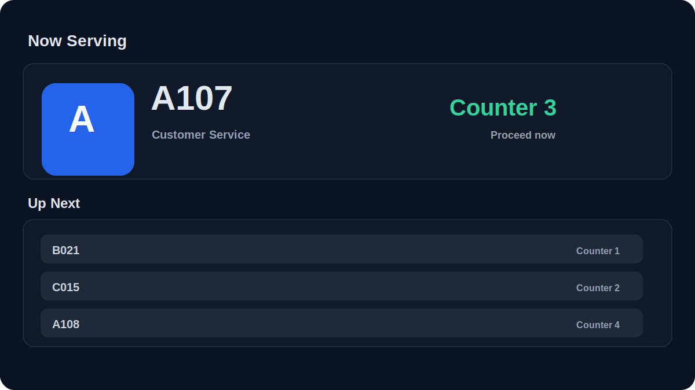
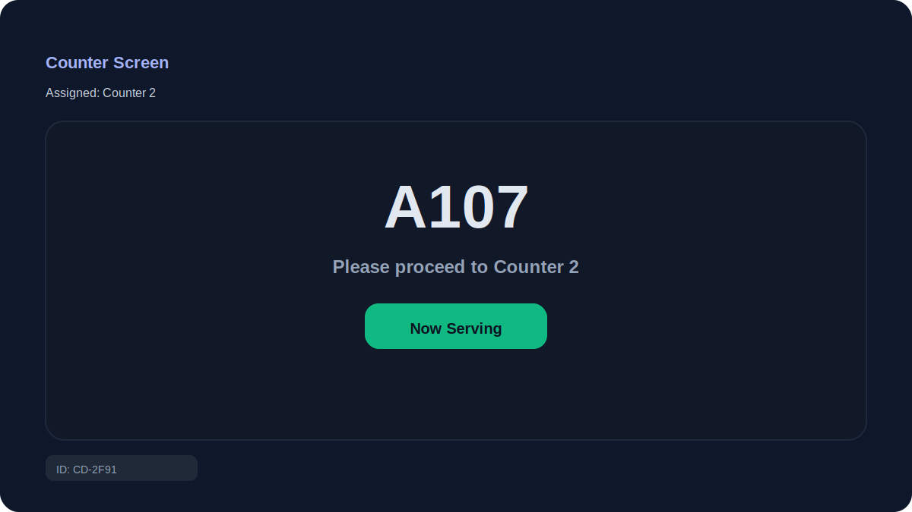
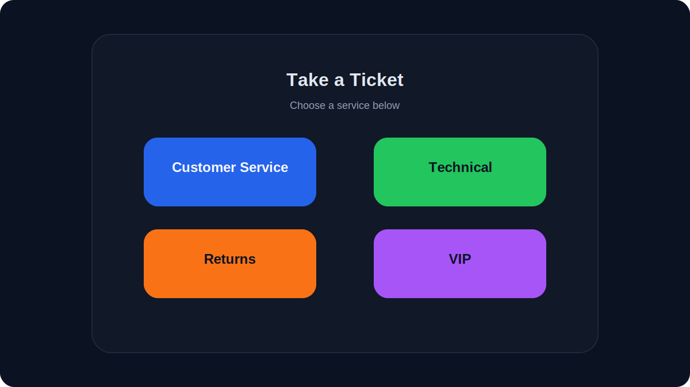
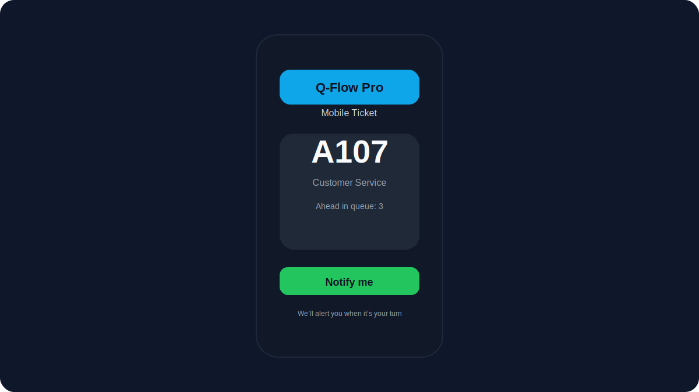

<div align="center">
  <h1>Q-Flow Pro</h1>
  <p>Queue and counter management with real-time updates, public displays, kiosk, counter screens, and admin panel.</p>
</div>

## Table of Contents
- [Features](#features)
- [Architecture](#architecture)
- [Screenshots](#screenshots)
- [Requirements](#requirements)
- [Quick Start (local)](#quick-start-local)
- [Environment Variables](#environment-variables)
- [Production Build](#production-build)
- [Run as systemd Service](#run-as-systemd-service)
- [Docker / Compose](#docker--compose)
- [Testing](#testing)
- [Admin Capabilities](#admin-capabilities)
- [Branding](#branding)
- [Data & Persistence](#data--persistence)
- [Operational Tips](#operational-tips)

## Features
- Pull tickets from kiosk, mobile client, or operator.
- Real-time updates via Socket.IO (queue state, calls, messages).
- Public display (“now serving”) and counter display for targeted calls.
- Admin panel for services, counters, users, printers, announcements, sound, and closing.
- Security: session TTL, password policy, helmet headers, sanitized settings, optional CSP.
- SQLite persistence with backups, log rotation, and `/health` endpoint.

## Architecture
- Frontend: React + Vite (TypeScript). Built assets served from `dist` by the Node server.
- Backend: Node.js + Express + Socket.IO. Persistence: SQLite (`data/qflow.db`).
- Server owns state/logging; clients receive `init-state` + `state-update` events.

## Screenshots
- Admin dashboard: 
- Public display: 
- Counter display: 
- Kiosk: 
- Mobile client: 

## Requirements
- Node.js 18+ (LTS recommended)
- npm (bundled with Node)
- SQLite (embedded, no extra install)
- For server deploy: systemd (optional) and open port 3000 (default)

## Quick Start (local)
```sh
npm install
cp .env.example .env   # adjust if needed
npm run dev             # Vite dev on 5173, API proxied to 3000
```
- Frontend dev: http://localhost:5173
- Backend: http://localhost:3000
- Default users on first run (`db.json` defaults): admin/Admin123!, operator/Operator123! — change after login.

## Environment Variables
See [.env.example](.env.example). Key settings:
- `HOST` / `PORT`: binding (default 0.0.0.0:3000)
- `ALLOWED_ORIGINS`: comma-separated origins for CORS/WebSocket (add your domain for prod)
- `ENABLE_CSP`: set `1` when frontend is CSP-clean
- `SESSION_TTL_HOURS`: session lifetime
- `LOG_RETENTION_DAYS`, `BACKUP_RETENTION_DAYS`: rotation periods

## Production Build
```sh
npm install
npm run build    # tsc + Vite build → dist/
npm start        # node server.js (serves dist/ and API)
```
Health: `GET /health`.

## Run as systemd Service
1) Copy unit: `sudo cp systemd/qflow.service /etc/systemd/system/qflow.service`
2) Environment: `/etc/qflow/qflow.env` (see .env.example) with permissions 640, owner `qflow`
3) User/ownership: `sudo useradd --system --home /opt/qflow --shell /usr/sbin/nologin qflow` and `sudo chown -R qflow:qflow /opt/qflow /etc/qflow`
4) Reload and start: `sudo systemctl daemon-reload && sudo systemctl enable --now qflow.service`
5) Status/logs: `systemctl status qflow.service` and `journalctl -u qflow.service -f`

Unit runs as user `qflow`, loads `/etc/qflow/qflow.env`, restarts on failure.

## Docker / Compose
Build image:
```sh
docker build -t qflow-pro .
```
Compose (see `docker-compose.yml`):
```sh
docker-compose up -d
```
Exposes port 3000. Set env vars via compose or an `.env` file referenced there.

## Testing
- E2E (Playwright): `npm run test:e2e`
- Health check: `curl http://localhost:3000/health`

## Admin Capabilities
- Login at `/` with admin account.
- Manage services, counters, users, printers, announcements, sounds, closing/opening.
- Backups: POST `/api/admin/backup`, list `/api/admin/backups`, download `/api/admin/backup/:file`.

## Branding
- Admin → General: set `brandText` and `brandLogoUrl` (base64/url). Empty `brandText` hides the text.
- Logo component allows custom logo + text; fallback is “Q-Flow Pro” only when text is unset.
- Text color is controlled per usage via `textClass` (dark UIs use white text).

## Data & Persistence
- SQLite DB at `data/qflow.db`; backups at `data/backups/`; logs at `data/logs/` (all git-ignored).
- Server loads state from DB on boot and persists changes (settings, tickets, users, etc.).
- Sessions stored in state with TTL (`SESSION_TTL_HOURS`).

## Operational Tips
- Set `ALLOWED_ORIGINS` to real domains before production.
- Place behind HTTPS reverse proxy (Nginx/Caddy) with TLS and optionally HSTS.
- Enable CSP (ENABLE_CSP=1) when assets are CSP-ready.
- Backup/log rotation is built-in; monitor disk and keep offsite copies if needed.
