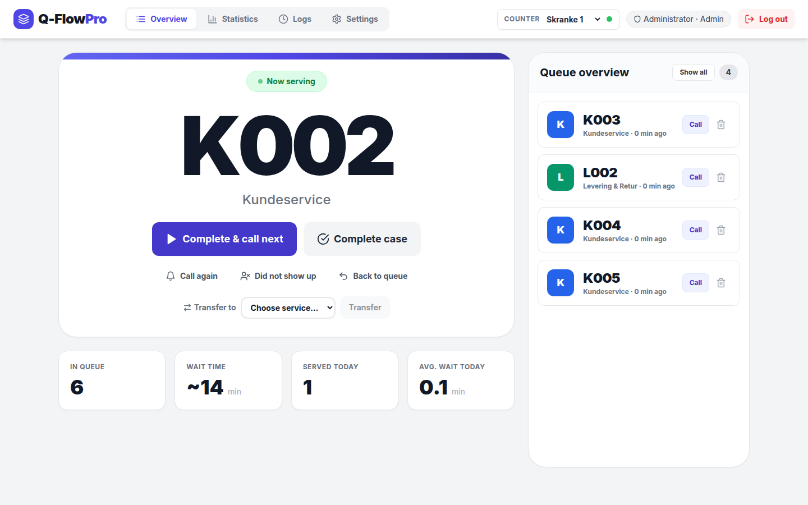
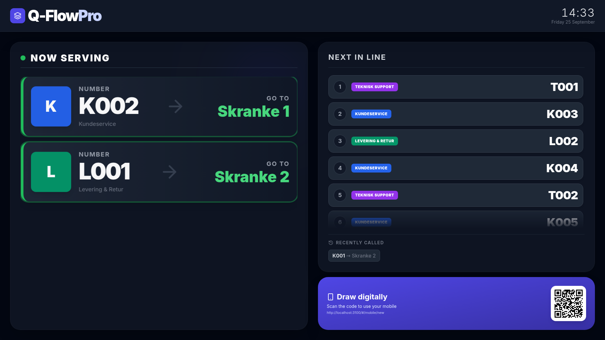
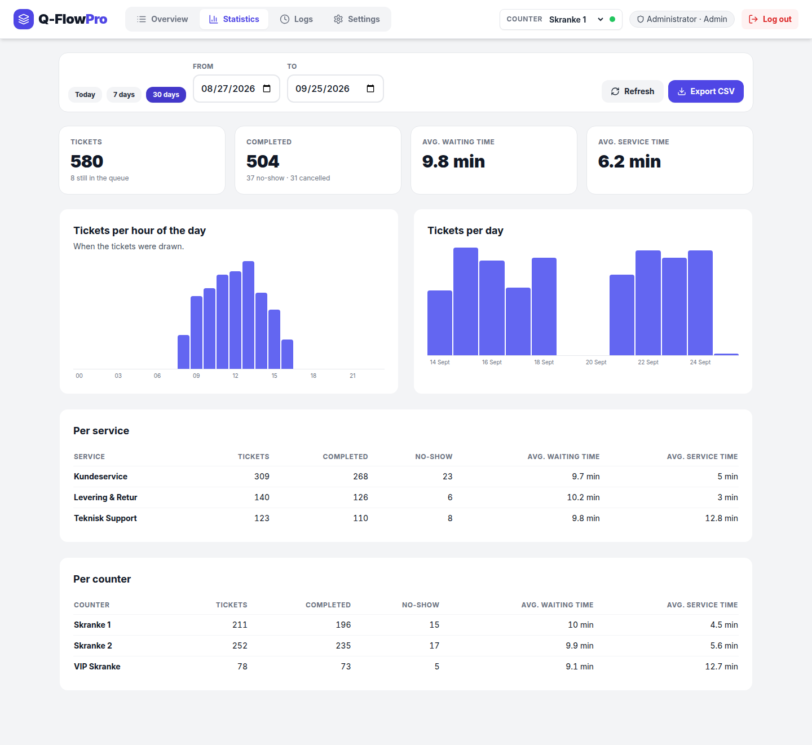
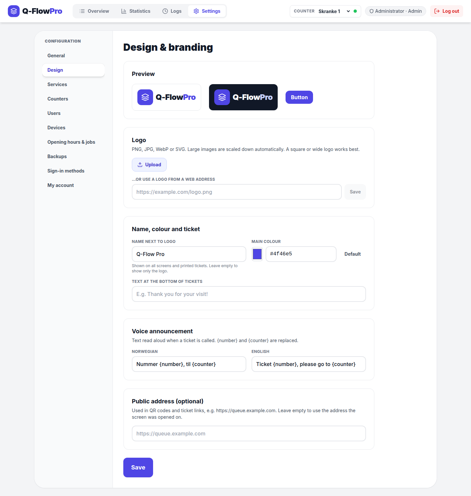
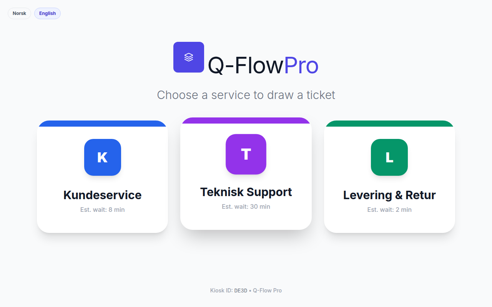
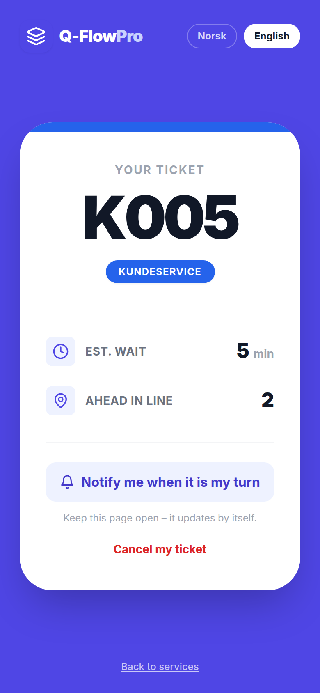

<div align="center">
  <h1>Q-Flow Pro</h1>
  <p>Self-hosted queue and counter management: ticket kiosk, mobile tickets, public and counter displays, operator panel and statistics – updated in real time.</p>
</div>

## 🌐 Demo

A live demo of the application is available here: **https://qflow-demo.matskk.com**

## ⚠️ Important Disclaimer

**This application is entirely developed using Artificial Intelligence (AI).**

The owner of this software makes **NO WARRANTIES** and assumes **NO LIABILITY** for:
- ❌ Software defects, bugs, or errors
- ❌ Security vulnerabilities or breaches
- ❌ Data loss, corruption, or integrity issues
- ❌ Compliance with laws, regulations, or standards
- ❌ Fitness for any particular purpose

**BY USING THIS SOFTWARE, YOU ACCEPT FULL RESPONSIBILITY FOR:**
- ✅ Testing and validating the software for your use case
- ✅ Implementing appropriate security measures
- ✅ Conducting security audits and vulnerability assessments
- ✅ Ensuring compliance with applicable requirements
- ✅ Any consequences resulting from use of this software

**USE AT YOUR OWN RISK.** See [LICENSE](LICENSE) for complete terms.

---

## Documentation
- **[Installation guide](INSTALLATION.md)** – install on Debian/Proxmox LXC (script or manual), update, back up, reverse proxy
- **[Brukerveiledning (norsk)](docs/brukerveiledning.md)** – daily use: kiosk, screens, operator panel, settings
- **[Security](SECURITY.md)** – security model and how to report issues · [Best practices](docs/security-best-practices.md)
- **[OAuth/OIDC sign-in](docs/oauth-oidc-auth.md)** – Google Workspace, Entra ID, Keycloak …
- **[User CLI](docs/cli.en.md)** ([norsk](docs/cli.md)) – manage users from the command line
- **[systemd](docs/systemd.en.md)** ([norsk](docs/systemd.md)) – service details
- **[Changelog](CHANGELOG.md)**

## Contents
- [Features](#features)
- [Screenshots](#screenshots)
- [Architecture](#architecture)
- [Quick install (Debian / Proxmox LXC)](#quick-install-debian--proxmox-lxc)
- [Configuration](#configuration)
- [Screens and URLs](#screens-and-urls)
- [Data, backups and statistics](#data-backups-and-statistics)
- [Security](#security)
- [Development and tests](#development-and-tests)
- [License](#license)

## Features

**For customers**
- **Kiosk** (touch screen): pick a service, get a number. Prints on a network receipt printer (Epson ESC/POS, port 9100) or shows the number on screen, with a QR code to follow the queue on a phone. Returns to the start screen by itself.
- **Mobile ticket** (`/#/mobile/new`, QR code on the public display): draw a ticket on the phone, see your place and estimated wait, get a vibration/sound/notification when it is your turn, cancel the ticket. Survives reloads.
- **Public display**: now serving, next in line (in the real call order), recently called, clock, scrolling message, chime + voice announcement (Norwegian/English) – works without internet.
- **Counter display**: a screen at each counter showing the number being served there.

**For staff**
- **Operator panel**: “call next” (the server picks the ticket, so two counters can never call the same one), call a specific ticket, call again, complete, did not show up, back to queue, transfer to another service, cancel.
- **Statistics**: tickets, waiting and service times per service, counter, hour and day; CSV export.
- **Opening hours**: open/close the queue automatically, reset numbering every night, daily backups.
- **Design**: your own logo, name, main colour (the whole interface follows it), ticket footer and announcement text.
- **Devices**: network printers (with test print), kiosks (activated per device, exit with PIN), counter displays with their own messages.
- **Users**: admins and operators, optional Google Workspace / OIDC sign-in, forced password change, user CLI.
- **Backups**: create, download, upload and restore from the admin panel.
- Norwegian and English interface.

## Screenshots

| Operator panel | Public display |
|---|---|
|  |  |
| **Statistics** | **Design settings** |
|  |  |
| **Kiosk** | **Mobile ticket** |
|  |  |

## Architecture
- **Frontend**: React + Vite + Tailwind (TypeScript), served as static files by the Node server.
- **Backend**: Node.js (22 LTS recommended) + Express + Socket.IO.
  - `server.js` – HTTP API, authentication, background jobs, wiring
  - `lib/socketHandlers.js` – real-time events (tickets, admin changes, devices)
  - `lib/queueService.js` / `lib/queue.js` – queue rules (order, numbering, estimates, opening hours)
  - `lib/stateViews.js` – what each role may see (public / operator / admin)
  - `lib/history.js` – ticket history and statistics
- **Storage**: SQLite (`qflow.db`): the live state as one JSON document plus a `ticket_history` table for statistics.
- Every change is decided by the server and pushed to all screens; each browser only receives the data its role needs.

## Quick install (Debian / Proxmox LXC)

On a fresh Debian 12/13 or Ubuntu LXC/VM, as root:

```sh
curl -fsSL https://raw.githubusercontent.com/matskkolstad/Q-Flow-Pro/main/scripts/install-lxc.sh | bash
```

The script installs Node.js 22, clones the code to `/opt/Q-Flow-Pro`, builds it, creates the `qflow` service user,
stores data in `/var/lib/qflow`, writes `/opt/Q-Flow-Pro/.env` and starts the `qflow` systemd service.
It prints the address and the first admin password at the end.

Update later with:

```sh
bash /opt/Q-Flow-Pro/scripts/update.sh
```

Manual installation, Docker, reverse proxy and upgrading from older versions: see **[INSTALLATION.md](INSTALLATION.md)**.

## Configuration

Settings are read from environment variables (`.env` when running under systemd). All options with comments: [.env.example](.env.example).

| Variable | Default | Purpose |
|---|---|---|
| `HOST` / `PORT` | `0.0.0.0` / `3000` | Where the server listens |
| `TZ` | system | Time zone for opening hours, nightly jobs and statistics (e.g. `Europe/Oslo`) |
| `QFLOW_DATA_DIR` | `./data` | Database, logs and backups |
| `SESSION_SECRET` | generated | Required for Google/OIDC sign-in across restarts |
| `QFLOW_ADMIN_USERNAME` / `QFLOW_ADMIN_PASSWORD` | `admin` / generated | First admin on a fresh install only |
| `TRUST_PROXY` | private networks | Which reverse proxies may set `X-Forwarded-For` |
| `ALLOWED_ORIGINS` | localhost | Extra origins allowed to call the API/WebSocket cross-origin (pages served by Q-Flow always work) |
| `SESSION_TTL_HOURS` | `12` | How long a sign-in lasts |
| `BACKUP_KEEP` / `BACKUP_RETENTION_DAYS` | `14` / `30` | How many backups to keep, and for how long |
| `LOG_RETENTION_DAYS` | `14` | Log file retention |
| `MAX_WAITING_TICKETS` | `500` | Refuse new tickets beyond this (spam protection) |
| `API_KEYS` | – | Keys for integrations calling `/api/print-ticket` |
| `ALLOWED_API_IPS` | – | Optional IP allowlist for the admin/print API |
| `GOOGLE_*` / `OIDC_*` | – | OAuth callback URLs (credentials are set in the admin panel) |

Everything else (services, counters, users, design, opening hours, devices, sign-in methods) is configured in the admin panel.

**First sign-in:** a fresh install creates the user `admin`. The password is `QFLOW_ADMIN_PASSWORD`, or a random one printed once in the log (`journalctl -u qflow | grep -A2 "first admin"`) that must be changed at first login. There are no default passwords.

## Screens and URLs

| URL | Screen | Who |
|---|---|---|
| `/` | Start page | everyone |
| `/#/login` | Sign in | staff |
| `/#/admin` | Operator panel, statistics, logs, settings | operators and admins |
| `/#/display` | Public display (TV) | public |
| `/#/counter-display?counterId=<id>` | Counter display | public |
| `/#/kiosk` | Ticket kiosk – must be activated once by an admin on the device | kiosk devices |
| `/#/mobile/new` | Draw a ticket on a phone | public |
| `/#/ticket/<id>?k=<key>` | Follow one ticket (link/QR from the kiosk or phone) | the ticket holder |

Displays play a chime and read the number aloud. Browsers only allow sound after someone has tapped the page once; the display shows a button for that.

## Data, backups and statistics
- The database is `$QFLOW_DATA_DIR/qflow.db`; logs are in `logs/` and backups in `backups/` next to it.
- A backup is taken automatically every night (time configurable) and can also be created, downloaded, uploaded and **restored** under *Settings → Backups*. A restore first saves the current data.
- The queue is reset automatically every night (numbering starts at 001 again); finished tickets stay in the statistics.
- Statistics are under *Statistics* in the admin panel and can be exported as CSV.
- The admin log keeps the latest 500 events; everything is also written to `logs/app-YYYY-MM-DD.log` and the journal.

## Security
- Each browser only receives what its role needs (public screens never get users, sessions, secrets or logs).
- Passwords are bcrypt-hashed; session tokens are random 256-bit values stored only as hashes; forced password changes are enforced by the server.
- Kiosks run with their own device token – no admin session stays on a public device.
- Rate limits for sign-in, tickets and anonymous socket events; `X-Forwarded-For` is only trusted from configured proxies.
- Put the server behind HTTPS (reverse proxy) when it is reachable from outside your LAN.

Details and how to report a vulnerability: **[SECURITY.md](SECURITY.md)**.

## Development and tests

```sh
npm install
npm run dev            # Vite on http://localhost:5173 (API proxied to :3000)
npm start              # in another terminal: the server on :3000 (after npm run build for production)
npm run lint           # ESLint
npm run typecheck      # TypeScript
npm run test:unit      # unit tests (node:test)
```

End-to-end tests (Playwright) run against a server with a fresh database:

```sh
QFLOW_DATA_DIR=/tmp/qflow-e2e QFLOW_ADMIN_PASSWORD='CiAdmin123!' TRUST_PROXY=false API_RATE_LIMIT_PER_MINUTE=1000 npm start
QFLOW_ADMIN_PASSWORD='CiAdmin123!' npm run test:e2e
```

CI (`.github/workflows/ci.yml`) runs lint, type check, build, dependency audit, unit and e2e tests and a Docker build on every push and pull request; CodeQL scans the code weekly.

## License

Copyright (c) 2026 Mats Kolstad. All rights reserved.

This software is provided under a **Proprietary License**. See [LICENSE](LICENSE) for full terms.

**Summary:**
- ✅ You MAY view, use, and modify the software for your own purposes
- ❌ You MAY NOT distribute, sell, or sublicense without written permission
- ⚠️ Software is provided "AS IS" with NO WARRANTIES
- ⚠️ Entire application is AI-generated - use at your own risk

For distribution, commercial licensing, or other inquiries, contact **matskkolstad** via GitHub.

**AI Disclaimer:** This application is entirely developed using Artificial Intelligence. The owner accepts no liability for errors, bugs, security issues, or any consequences of use. Users assume full responsibility for testing, security, and compliance.
